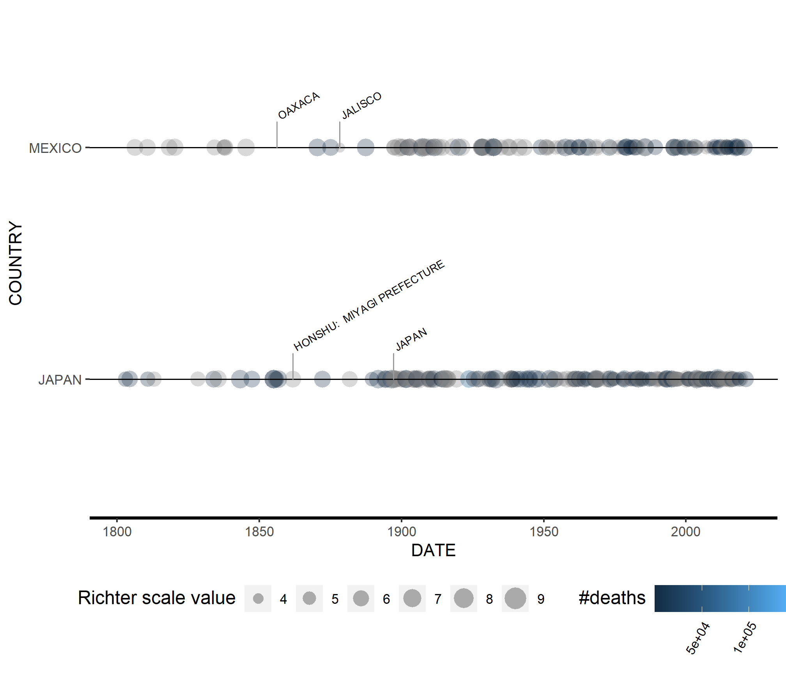
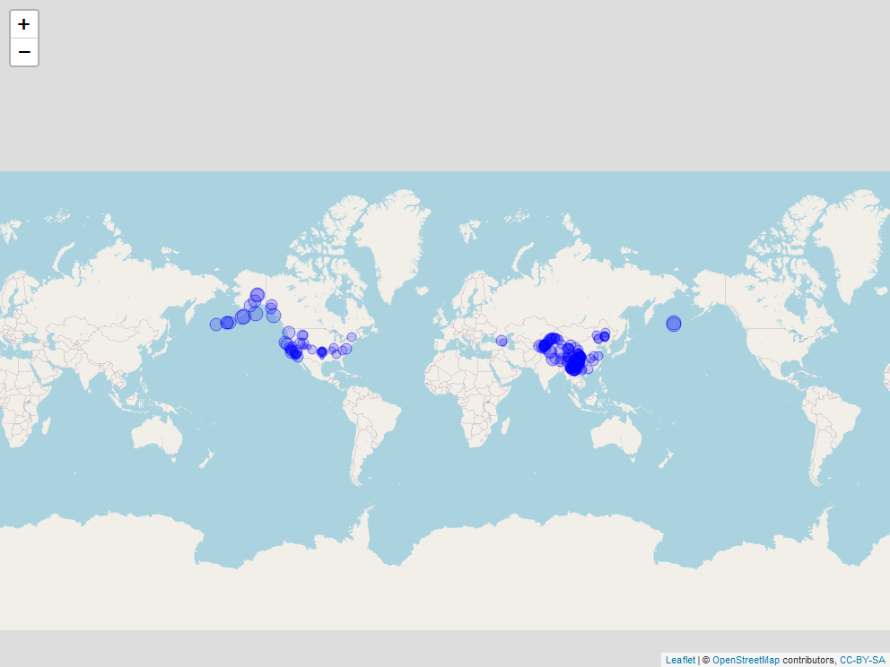

<!-- README.md is generated from README.Rmd. Please edit that file -->

# noaa

<!-- badges: start -->

[](https://github.com/philippB-on-git/noaa/actions)
[](https://travis-ci.com/philippB-on-git/noaa)
<!-- badges: end -->

The goal of noaa is to visualize earthquake data obtained from U.S.
National Oceanographic and Atmospheric Administration (NOAA): Earthquake
Database. NOAA National Centers for Environmental Information.
[doi:10.7289/V5TD9V7K](https://www.ncei.noaa.gov/access/metadata/landing-page/bin/iso?id=gov.noaa.ngdc.mgg.hazards:G012153)

## Installation

You can install the development version of noaa from
[GitHub](https://github.com/) with:

``` r
# install.packages("devtools")
devtools::install_github("philippB-on-git/noaa")
```

## Example

The package provides functionality to read, clean and visualize noaa
data:

``` r
library(dplyr)
library(noaa)

noaa_data <- system.file("extdata", "noaa_earthquakes.tsv", package = "noaa") %>%
    eq_read_data %>%
    eq_clean_data %>%
    filter(COUNTRY %in% c("MEXICO", "JAPAN") & YEAR > 1800)

timeline <- noaa_data %>%
    plot_eq_timeline(label = NULL)

timeline +
    geom_timeline_label(data = noaa_data, mapping = ggplot2::aes(y = COUNTRY, label = LOCATION_NAME), n_max = 3)
#> Warning: Removed 4 rows containing missing values (ggproto_timeline).
```



Mapping of earthquake locations on maps:

``` r
noaa_data %>%
    mutate(info_text = eq_create_label(.)) %>%
    eq_map(annot_col = "info_text")
```


